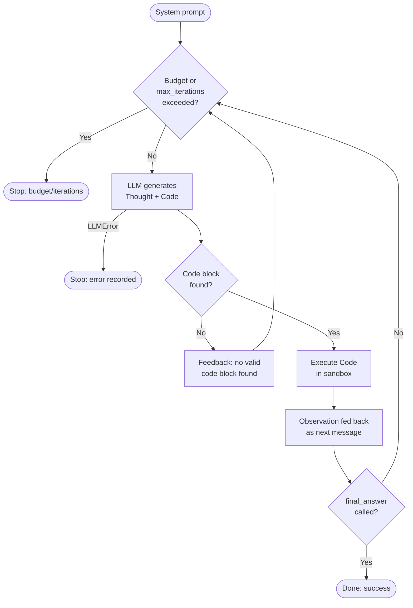

*This project has been created as part of the 42 curriculum by Kebertra, Gtourdia.*

# Agent Smith

## Description

Agent Smith is an autonomous coding agent built for the 42 "Agent Smith" project.
It solves programming benchmark tasks (MBPP and SWE-bench) entirely on its own:
given a task description, it reasons about the problem, writes Python code, and
iterates based on real execution feedback — without human intervention, and
without ever seeing hidden test cases upfront.

The agent runs a **Thought → Code → Observation** loop against a real LLM (with
support for multiple providers, e.g. DeepSeek, OpenRouter), executing every piece
of generated code inside an isolated Docker sandbox with no network access,
restricted filesystem access, and a locked-down Python builtin/import allowlist.
Benchmark-specific actions (running tests, reading/editing files, searching code,
retrieving a git patch, etc.) are exposed to the agent as tools through the
**Model Context Protocol (MCP)**, keeping the core reasoning loop entirely generic
and reusable across benchmarks.

The project covers two benchmarks:
- **MBPP** — the agent writes a single Python function from a natural-language
  description and verifies it against hidden unit tests before submitting.
- **SWE-bench** — the agent explores a real open-source repository (e.g. Django),
  locates and fixes a real reported bug, verifies its fix against the repository's
  own test suite, and submits a git patch.

Every run produces a fully traceable `solution.json` (system prompt, per-step LLM
output, sandbox input/output, token usage, timing) so its reasoning process can be
audited and reproduced.

## System Architecture

### Repository Layout

```
.
├── mcp_tools_mbpp.py        # MCP server exposing MBPP-specific tools (run_tests)
├── mcp_tools_swebench.py    # MCP server exposing SWE-bench-specific tools (9 tools)
├── sandbox_template.json    # Default SandboxConfig used by every run
├── Makefile                 # task/tasks/run/runs targets, lint, install
└── student/
    ├── agent_core/          # Benchmark-agnostic agent engine
    │   ├── loop.py          #   Thought → Code → Observation loop
    │   ├── parsing.py       #   Code extraction from raw LLM output
    │   ├── manual.py        #   Tool documentation generator (system prompt)
    │   ├── sandbox_client.py#   Generic sandbox transport
    │   ├── schemas.py       #   Shared data contract (StepMetrics, SolutionOutput)
    │   ├── shutdown.py      #   Graceful SIGTERM handling
    │   └── provider/        #   LLM provider abstraction (litellm-based)
    ├── agent_mbpp/          # MBPP entry point (`python -m agent_mbpp`)
    ├── agent_swebench/      # SWE-bench entry point (`python -m agent_swebench`)
    ├── sandbox/             # Docker sandbox: lifecycle, restrictions, MCP bridge
    │   ├── cli.py           #   `uv run sandbox` entry point (REPL mode)
    │   ├── config.py        #   SandboxConfig (limits, allowlists) — Pydantic model
    │   ├── container.py     #   Container lifecycle, tmpfs, derived image, labels
    │   ├── mcp_bridge.py     #   Host-side MCP client (stdio/HTTP), key spawn env
    │   ├── repl.py           #   Interactive human REPL over the JSON Lines protocol
    │   ├── session.py        #   Shared container+tools bootstrap (REPL & agent_core)
    │   └── executor/         #   Code that runs *inside* the container
    │       ├── protocol.py   #     JSON Lines message schemas (MsgType, TypedDicts)
    │       ├── restrictions.py#    Import allowlist + builtins restriction
    │       ├── runner.py     #     The exec loop: reads code, runs it, replies
    │       └── watchdog.py   #     Per-execution timeout (SIGALRM-based)
    └── mcp_server_shared/    # Constants shared by both MCP tool servers
```

### Data Contract (StepMetrics / SolutionOutput)

`agent_core/schemas.py` defines the models both benchmarks write to `solution.json`,
mirroring the moulinette's own reference contract:

```python
class StepMetrics(BaseModel):
    """Metrics for a single agent step — one LLM generate -> sandbox execute cycle."""

    step: int = Field(..., ge=1)               # 1-indexed iteration number
    input_tokens: int
    output_tokens: int
    request_time_ms: float                     # wall-clock time for the LLM call
    timestamp: str = Field(default_factory=...)
    api_url: str = ""
    model_name: str = ""
    llm_output: str = ""                       # raw text before code extraction
    sandbox_input: str = ""                    # code actually sent to the sandbox
    sandbox_output: str = ""                   # sandbox stdout/stderr/error
    retries: int = 0
    usage_reported: bool = True                # False = provider didn't report usage
```

```python
class SolutionOutput(BaseModel):
    """The full run — required format for evaluation, validated by the moulinette."""

    task_id: str
    benchmark: Literal["mbpp", "swebench"]
    success: bool
    solution: str                              # function code (MBPP) or git patch (SWE-bench)
    iterations: int
    total_requests: int
    total_input_tokens: int
    total_output_tokens: int
    total_time_seconds: float
    steps: list[StepMetrics] = Field(default_factory=list)
    system_prompt: str = ""                    # full prompt sent to the LLM — provenance
    error: str | None = None
    timestamp: str = Field(default_factory=...)
```

`TaskInput` is a thin typing anchor only — MBPP and SWE-bench tasks share no
fields (`task_id: int` vs `instance_id: str`), so each benchmark defines its own
task model next to the code that uses it (`agent_mbpp/task.py`, `agent_swebench/task.py`).

### MCP Protocol (Tools, Resources, Prompts)

The sandbox container is an MCP **client** (`sandbox/mcp_bridge.py`); `mcp_tools_mbpp.py`
and `mcp_tools_swebench.py` are independent MCP **servers** (built with FastMCP),
each exposing:

- **Tools** — the actions the agent can call from inside the sandbox (e.g.
  `run_tests`, `edit_file`, `search_code`, `get_patch`).
- **Resources** — the current task exposed as read-only context (`mbpp://task`,
  `swebench://task`).
- **Prompts** — a ready-to-use resolution template (`solve_mbpp_task`,
  `solve_swebench_task`).

Both **stdio** and **HTTP streamable** transports are supported, selected via the
`MCP_TRANSPORT` environment variable.

### LLM Providers & Multi-Key Rotation

`agent_core/provider/base.py` wraps [litellm](https://github.com/BerriAI/litellm)'s
`Router` behind a single `LLM` class, so the rest of the agent never talks to a
provider SDK directly. A model is addressed as `"provider/model-name"`
(e.g. `deepseek/deepseek-v4-flash`, `openrouter/z-ai/glm-5.2:free`), and an
optional `--provider-url` overrides the API base for providers that need it
(e.g. OpenRouter).

Multiple API keys for the same provider (comma-separated in
`PROVIDER_API_KEY`/`PROVIDER_API_KEYS`) are rotated automatically: each key is
registered as its own Router deployment and dispatched to by id, guaranteeing
every key is tried at most once per call before giving up — round-robining the
starting key across calls so successful traffic is spread across the whole pool.

## Agent Loop Explanation

### Thought → Code → Observation Cycle

`agent_core/loop.py::run()` drives the whole agent: at each iteration, the LLM is
asked to produce a short **Thought** (plain-text reasoning) followed by exactly one
**Code** block, which is executed inside the sandbox. The result is fed back as an
**Observation** message, and the cycle repeats until the model calls `final_answer(...)`,
`max_iterations` is reached, or a cumulative budget is exhausted. The system prompt
(built per-benchmark in `agent_mbpp/__main__.py`/`agent_swebench/__main__.py`) always
includes a full worked example of this cycle — found empirically to make the
difference between a model that reliably calls tools and one that doesn't.



### Code Extraction (Supported Model Formats)

Not every model follows the fenced ` ```python ` block shown in the example.
`agent_core/parsing.py::extract_code()` tries, in order:

1. A fenced ` ```python ` block (the primary format), and its unclosed-fence variant.
2. A DeepSeek-specific native `<｜DSML｜...>` tool-calling dialect (two variants
   found empirically: an `<invoke>`/`<parameter>` form, and a raw `python`-tagged form).
3. A Liquid-specific `<|tool_call_start|>[...]<|tool_call_end|>` dialect (already
   valid Python call syntax, parsed via `ast` rather than a bespoke grammar).
4. XML-style `<invoke name="...">`/`<parameter name="...">` tool calls, with
   parameter values typed by the tool's real declared JSON Schema (not guessed
   from the string's shape).
5. JSON/Hermes-style `<tool_call>{...}</tool_call>` blocks.
6. ReAct-style `Action: tool` / `Action Input: {...}` pairs.

Every one of these was added after observing a real model default to it instead of
the documented format — not implemented speculatively.

### Cumulative Budgets & Graceful Shutdown

`loop.run()` accepts `max_input_tokens`, `max_output_tokens`, and `max_time_seconds`,
checked at the start of every iteration against the running total so far. Both
`agent_mbpp` and `agent_swebench` set their `max_time_seconds` to **90% of the
external hard timeout** (108s/810s instead of 120s/900s), leaving a safety margin
for a graceful shutdown to win the race against the moulinette's own SIGTERM/SIGKILL.

`agent_core/shutdown.py` converts a received `SIGTERM` into a `Terminated`
(`SystemExit` subclass) exception, so the existing `with container:` block still
unwinds cleanly and removes the Docker container instead of leaving it orphaned.

### Error Diagnostics

`loop.run()` returns `(steps, final_answer, error)` — the third element carries the
underlying `LLMError`'s message when that is why the loop stopped, so a provider
failure (rate limit, invalid key, malformed response) shows up as a real, actionable
message in `solution.json`'s `error` field instead of an opaque `error: null`
indistinguishable from a normal `max_iterations` run.

## Sandbox Design

### Interaction Overview

```mermaid
sequenceDiagram
    participant Loop as agent_core.loop (host)
    participant Runner as executor/runner.py (in container)
    participant Session as session.py relay (host)
    participant Bridge as mcp_bridge.py (host)
    participant Server as mcp_tools_*.py (subprocess)

    Loop->>Runner: exec code (JSON Lines, stdin)
    Note over Runner: code runs under restrictions.py<br/>import/builtins allowlist
    Runner->>Session: tool_call message (stdout)
    Session->>Bridge: call_tool(name, args)
    Bridge->>Server: MCP tool call (stdio/HTTP)
    Note over Server: e.g. run_tests(), edit_file()<br/>no sandbox restrictions here
    Server-->>Bridge: tool result
    Bridge-->>Session: tool result
    Session->>Runner: tool_result message (stdin)
    Note over Runner: tool stub returns value,<br/>execution resumes
    Runner-->>Loop: result/error message (stdout)
    Note over Loop: fed back as the next Observation message
```

The sandbox container never talks to the MCP server directly — every tool call
is relayed through the host process (`session.py`), which is the only side with
network/Docker access. This split is what lets the container itself keep
`network_mode="none"` while tools like `run_tests()` remain fully functional.

### Docker Isolation

Every session gets its own container, built from a derived image (base image +
the executor code baked in via `COPY --chown=1000:1000`, since `docker cp` into a
read-only container fails at runtime). Isolation constraints (§V.2.3):

- **`network_mode="none"`** — no network access at all, from inside the container.
- **`read_only=True`** rootfs, with `tmpfs` mounted on `/workspace` and `/tmp`
  (4 GB, explicit `exec` — Docker mounts tmpfs `noexec` by default even without
  requesting it, which silently breaks any script that tries to run from there).
- **`cap_drop=["ALL"]`** — no Linux capabilities, including for `docker exec`
  calls made by the SWE-bench tools (still can't bypass file permissions as root).
- **`pids_limit`** and **`mem_limit`** — fork-bomb and memory-exhaustion protection.

### Restricted Execution Environment

Docker isolates the OS; `sandbox/executor/restrictions.py` is what stops
`import os` or dangerous builtins at the **Python** level inside the container
(no `RestrictedPython` or AST sandboxing — explicitly forbidden by the subject):

- A `sys.meta_path` hook (`RestrictedImportFinder`) rejects any import not in the
  task's `authorized_imports` allowlist.
- `os` is purged from `sys.modules` explicitly at startup — it is already loaded
  by CPython's own bootstrap before any sandboxed code runs, and Python checks
  `sys.modules` *before* consulting `sys.meta_path`, so the hook alone would
  never see a re-import of an already-cached module.
- `builtins` are replaced with an explicit allowlist.
- A per-execution timeout (`executor/watchdog.py`, `SIGALRM`-based) bounds any
  single call, independent of the agent's own cumulative time budget.

**Known, documented limitation**: object introspection
(`().__class__.__bases__[0].__subclasses__()`) can reach classes already loaded
in memory without ever calling `import`, bypassing the builtins allowlist. Closing
this fully would require a real AST-level sandbox, which the subject explicitly
forbids — Docker's own isolation (no network, read-only filesystem, no
capabilities) remains the actual security boundary; this module is defense in
depth on top of it, not the only line of defense.

### Container Lifecycle & Multi-Session Safety

`SandboxContainer` is a context manager: `with container:` guarantees the
container (and its derived image) are stopped and removed on exit — including on
a genuine `SIGTERM` from the exam harness, converted into a catchable exception
by `agent_core/shutdown.py` so cleanup still runs before the process dies.

Running two sandbox sessions at once (e.g. one MBPP and one SWE-bench run in
parallel) is supported safely: every container is stamped with a
`agent-smith.owner-pid` Docker label at creation, and the MCP server spawned for
that session receives the same PID via `SANDBOX_OWNER_PID` — so SWE-bench's
container-discovery tools (which run `docker exec` from outside the sandbox's own
restrictions) always find *their own* session's container, never another one
running concurrently.

## Tool Implementation Details
### MBPP Tools
### SWE-Bench Tools

## Instructions
### Prerequisites
### Installation
### Configuration (API Keys / .env)
### Running the Agent (MBPP / SWE-Bench)
### Interactive Sandbox REPL
### Makefile Targets

## Benchmark Results and Analysis
### Summary
### Key Findings
### Full Report

## Resources
### References
### AI Usage Disclosure
